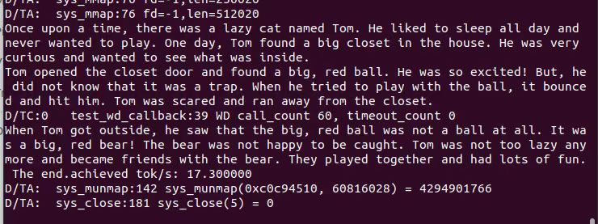

It is currently confirmed that this code can run stably on version 4.2.0, but there are many issues with version 4.4.0. Due to the rapid iteration of OP-TEE (and related projects) and the shift in my current research focus, I will not be maintaining the code in this repository.

Many thanks to [@Jian Zhaolong](https://github.com/JolyonJian) for his help. [Here](./run.md) is a more detailed documentation for using the code.
# 程序使用方法
**其中的路径需要根据自己需要调节**
## 配置musl
使用修改后的 musl-libc 编译 llama2.c 程序
```
# 配置musl-libc
cd elf-musl-libc
./configure --target=aarch64 --prefix=/musl CROSS_COMPILE=/optee/toolchains/aarch64/bin/aarch64-linux-gnu-
```
编译llama2.c的run.c
```
/musl/bin/musl-gcc run.c -O3 -fpie -pie -o run
```
这里目前需要把llama2.c内的路径改为绝对路径
```
cd llama2.c 
vim run.c
```
修改下面的内容
```C
char *tokenizer_path = "/root/tokenizer.bin"; // 根据REE侧的文件路径调节
```
## 编译OP-TEE
根据 [optee documentation 在 QEMUv8 上的方法执行编译过程](https://optee.readthedocs.io/en/latest/building/devices/qemu.html#qemu-v8)

如果使用docker直接使用下面的docker file，或者安装下面的包
```
FROM ubuntu:22.04
ARG DEBIAN_FRONTEND=noninteractive
RUN apt update && apt upgrade -y
RUN apt install -y \
    adb \
    acpica-tools \
    autoconf \
    automake \
    bc \
    bison \
    build-essential \
    ccache \
    cpio \
    cscope \
    curl \
    device-tree-compiler \
    e2tools \
    expect \
    fastboot \
    flex \
    ftp-upload \
    gdisk \
    git \
    libattr1-dev \
    libcap-ng-dev \
    libfdt-dev \
    libftdi-dev \
    libglib2.0-dev \
    libgmp3-dev \
    libhidapi-dev \
    libmpc-dev \
    libncurses5-dev \
    libpixman-1-dev \
    libslirp-dev \
    libssl-dev \
    libtool \
    libusb-1.0-0-dev \
    make \
    mtools \
    netcat \
    ninja-build \
    python3-cryptography \
    python3-pip \
    python3-pyelftools \
    python3-serial \
    python-is-python3 \
    rsync \
    swig \
    unzip \
    uuid-dev \
    wget \
    xdg-utils \
    xterm \
    xz-utils \
    zlib1g-dev
RUN curl https://storage.googleapis.com/git-repo-downloads/repo > /bin/repo && chmod a+x /bin/repo
RUN mkdir /optee
WORKDIR /optee
RUN repo init -u https://github.com/OP-TEE/manifest.git -m qemu_v8.xml && repo sync -j10
WORKDIR /optee/build
RUN make -j2 toolchains
RUN make -j$(nproc) check
```

如果在windows上使用docker，可以通过x11转发：
```
export DISPLAY=192.168.191.100:0.0
```
得到terminal，如是虚拟机请忽略。
## 修改QEMU安全内存大小
首先进入/optee的根目录之中

在QEMU文件夹内，修改地址范围
```
diff --git a/hw/arm/virt.c b/hw/arm/virt.c
index 7d9dbc2..fde5b6a 100644
--- a/hw/arm/virt.c
+++ b/hw/arm/virt.c
@@ -158,12 +158,14 @@ static const MemMapEntry base_memmap[] = {
     [VIRT_MMIO] =               { 0x0a000000, 0x00000200 },
     /* ...repeating for a total of NUM_VIRTIO_TRANSPORTS, each of that size */
     [VIRT_PLATFORM_BUS] =       { 0x0c000000, 0x02000000 },
-    [VIRT_SECURE_MEM] =         { 0x0e000000, 0x01000000 },
+    // [VIRT_SECURE_MEM] =         { 0x0e000000, 0x01000000 },
+    [VIRT_SECURE_MEM] =         { 0x40000000, 0x08000000 },
     [VIRT_PCIE_MMIO] =          { 0x10000000, 0x2eff0000 },
     [VIRT_PCIE_PIO] =           { 0x3eff0000, 0x00010000 },
     [VIRT_PCIE_ECAM] =          { 0x3f000000, 0x01000000 },
     /* Actual RAM size depends on initial RAM and device memory settings */
-    [VIRT_MEM] =                { GiB, LEGACY_RAMLIMIT_BYTES },
+    // [VIRT_MEM] =                { GiB, LEGACY_RAMLIMIT_BYTES },
+    [VIRT_MEM] =                { 0x48000000, LEGACY_RAMLIMIT_BYTES-0x08000000 },
 };
```
在u-boot文件夹之中
```
diff --git a/board/emulation/qemu-arm/qemu-arm.c b/board/emulation/qemu-arm/qemu-arm.c
index 34ed3e8a..8aaae101 100644
--- a/board/emulation/qemu-arm/qemu-arm.c
+++ b/board/emulation/qemu-arm/qemu-arm.c
@@ -71,8 +71,10 @@ static struct mm_region qemu_arm64_mem_map[] = {
                         PTE_BLOCK_PXN | PTE_BLOCK_UXN
        }, {
                /* RAM */
-               .virt = 0x40000000UL,
-               .phys = 0x40000000UL,
+               /*.virt = 0x40000000UL,
+               .phys = 0x40000000UL,*/
+               .virt = 0x48000000UL,
+               .phys = 0x48000000UL,
                .size = 255UL * SZ_1G,
                .attrs = PTE_BLOCK_MEMTYPE(MT_NORMAL) |
                         PTE_BLOCK_INNER_SHARE
diff --git a/board/emulation/qemu-arm/qemu-arm.env b/board/emulation/qemu-arm/qemu-arm.env
index e658d5ee..19c318a6 100644
--- a/board/emulation/qemu-arm/qemu-arm.env
+++ b/board/emulation/qemu-arm/qemu-arm.env
@@ -4,9 +4,14 @@
 
 fdt_high=0xffffffff
 initrd_high=0xffffffff
-fdt_addr=0x40000000
+/*fdt_addr=0x40000000
 scriptaddr=0x40200000
 pxefile_addr_r=0x40300000
 kernel_addr_r=0x40400000
-ramdisk_addr_r=0x44000000
+ramdisk_addr_r=0x44000000*/
+fdt_addr=0x48000000
+scriptaddr=0x48200000
+pxefile_addr_r=0x48300000
+kernel_addr_r=0x48400000
+ramdisk_addr_r=0x4C000000
 boot_targets=qfw usb scsi virtio nvme dhcp
diff --git a/configs/qemu_arm64_defconfig b/configs/qemu_arm64_defconfig
index 94bd9667..e2a2dffd 100644
--- a/configs/qemu_arm64_defconfig
+++ b/configs/qemu_arm64_defconfig
@@ -4,14 +4,14 @@ CONFIG_ARCH_QEMU=y
 CONFIG_SYS_MALLOC_LEN=0x1000000
 CONFIG_NR_DRAM_BANKS=1
 CONFIG_HAS_CUSTOM_SYS_INIT_SP_ADDR=y
-CONFIG_CUSTOM_SYS_INIT_SP_ADDR=0x40200000
+CONFIG_CUSTOM_SYS_INIT_SP_ADDR=0x48200000
 CONFIG_ENV_SIZE=0x40000
 CONFIG_ENV_SECT_SIZE=0x40000
 CONFIG_DEFAULT_DEVICE_TREE="qemu-arm64"
 CONFIG_DEBUG_UART_BASE=0x9000000
 CONFIG_DEBUG_UART_CLOCK=0
 CONFIG_ARMV8_CRYPTO=y
-CONFIG_SYS_LOAD_ADDR=0x40200000
+CONFIG_SYS_LOAD_ADDR=0x48200000
 CONFIG_ENV_ADDR=0x4000000
 CONFIG_PCI=y
 CONFIG_DEBUG_UART=y
diff --git a/configs/qemu_arm_defconfig b/configs/qemu_arm_defconfig
index 7cb1e9f0..67d254c9 100644
--- a/configs/qemu_arm_defconfig
+++ b/configs/qemu_arm_defconfig
@@ -4,7 +4,7 @@ CONFIG_ARCH_QEMU=y
 CONFIG_SYS_MALLOC_LEN=0x1000000
 CONFIG_NR_DRAM_BANKS=1
 CONFIG_HAS_CUSTOM_SYS_INIT_SP_ADDR=y
-CONFIG_CUSTOM_SYS_INIT_SP_ADDR=0x40200000
+CONFIG_CUSTOM_SYS_INIT_SP_ADDR=0x48200000
 CONFIG_ENV_SIZE=0x40000
 CONFIG_ENV_SECT_SIZE=0x40000
 CONFIG_DEFAULT_DEVICE_TREE="qemu-arm"
@@ -12,7 +12,7 @@ CONFIG_TARGET_QEMU_ARM_32BIT=y
 CONFIG_DEBUG_UART_BASE=0x9000000
 CONFIG_DEBUG_UART_CLOCK=0
 CONFIG_ARMV7_LPAE=y
-CONFIG_SYS_LOAD_ADDR=0x40200000
+CONFIG_SYS_LOAD_ADDR=0x48200000
 CONFIG_ENV_ADDR=0x4000000
 CONFIG_PCI=y
 CONFIG_DEBUG_UART=y
diff --git a/include/configs/qemu-arm.h b/include/configs/qemu-arm.h
index e296f398..cbe612b2 100644
--- a/include/configs/qemu-arm.h
+++ b/include/configs/qemu-arm.h
@@ -7,8 +7,8 @@
 #define __CONFIG_H
 
 /* Physical memory map */
-#define CFG_SYS_SDRAM_BASE             0x40000000
-
+/*#define CFG_SYS_SDRAM_BASE           0x40000000*/
+#define CFG_SYS_SDRAM_BASE             0x48000000
 /* For timer, QEMU emulates an ARMv7/ARMv8 architected timer */
 
 #endif /* __CONFIG_H */
```
在trusted-firmware-a/plat/qemu/qemu/include/platform_def.h文件夹之中
```
diff --git a/plat/qemu/qemu/include/platform_def.h b/plat/qemu/qemu/include/platform_def.h
index 903c809..1121cd1 100644
--- a/plat/qemu/qemu/include/platform_def.h
+++ b/plat/qemu/qemu/include/platform_def.h
@@ -79,14 +79,19 @@
 #define SEC_ROM_BASE                   0x00000000
 #define SEC_ROM_SIZE                   0x00020000
 
-#define NS_DRAM0_BASE                  ULL(0x40000000)
-#define NS_DRAM0_SIZE                  ULL(0xc0000000)
-
-#define SEC_SRAM_BASE                  0x0e000000
+//#define NS_DRAM0_BASE                        ULL(0x40000000)
+//#define NS_DRAM0_SIZE                        ULL(0xc0000000)
+#define NS_DRAM0_BASE                   ULL(0x48000000)
+#define NS_DRAM0_SIZE                   ULL(0xB8000000)
+
+//#define SEC_SRAM_BASE                        0x0e000000
+//#define SEC_SRAM_SIZE                        0x00100000
+#define SEC_SRAM_BASE                  0x40000000
 #define SEC_SRAM_SIZE                  0x00100000
-
-#define SEC_DRAM_BASE                  0x0e100000
-#define SEC_DRAM_SIZE                  0x00f00000
+//#define SEC_DRAM_BASE                        0x0e100000
+//#define SEC_DRAM_SIZE                        0x00f00000
+#define SEC_DRAM_BASE                  0x40100000
+#define SEC_DRAM_SIZE                  0x07f00000
 
 #define SECURE_GPIO_BASE               0x090b0000
 #define SECURE_GPIO_SIZE               0x00001000
```
## 使用本项目代码
把elf-optee-client、elf-optee-os、elf-optee-test、elf-build文件夹替换到上一步按照官方文档的/optee目录内（替换同名的文件夹）

把```elf-ta```加入到```/optee_examples```
目录其中，再次执行编译过程
```
make run -j
```

此时 OPTEE 项目编译完成。

## 运行程序
将 llama2.c 的参数、词汇表等文件，以及编译好的elf文件放入out-br之中的REE侧文件系统home目录之中
```
/optee/out-br/target/root
```
最后运行
```
elf_ta_loader ./run /root/stories15M.bin
# 参数路径可能需要修改
```
## QEMU与主机共享文件夹
如果不想每次停机QEMU，在开机时复制或修改文件，需要开启QEMU和主机的共享文件夹，步骤如下：
```
# 在编译阶段
make QEMU_VIRTFS_ENABLE=y QEMU_USERNET_ENABLE=y run-only
```
而后在弹出来的REE侧的terminal之中，运行
```
mkdir -p /mnt/host
mount -t 9p -o trans=virtio host /mnt/host
cd /mnt/host/loader_test/
```

然后运行命令
```
elf_ta_loader ./run /mnt/host/loader_test/stories15M.bin
```

TEE侧的输出


## 在树莓派之中运行
编译过程与QEMU类似，具体参考[官方文档](https://optee.readthedocs.io/en/latest/building/devices/rpi3.html)。

需要注意的是，OP-TEE项目在树莓派运行的makefile中优化了编译选项，因此拷贝到out-br之中的文件会被裁剪符号表。

因此需要提前保留好libc.so elf等文件，在img拷贝到SD卡后，再将文件拷贝到SD卡中。或者使用官方文档的内网传输协议（类似QEMU共享文件夹）

树莓派的安全内存大小的配置修改需要修改plat-rpi3/conf.mk文件即可
